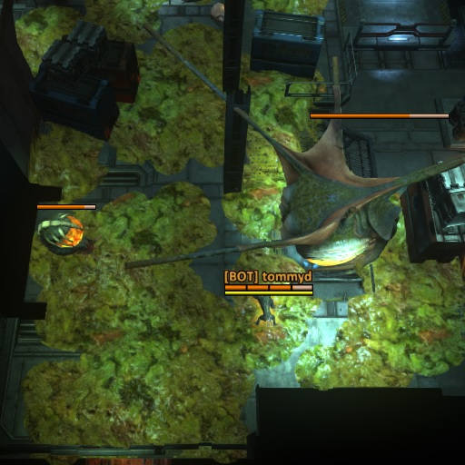

# ExtraInsightMod
Lua mod for Natural Selection 2 that augments the spectator view (known as Insight) with additional features.  
Client-side Insight mod; available in the [steam workshop](http://steamcommunity.com/sharedfiles/filedetails/?id=261331692).

ModId: f939aec

## Features
Mod is currently unfinished, but still might be useful to some people, especially if you are casting a match on a non-ensl server.
Here are the current features:
* High-contrast armor bars
* Armor bars on structures
* High-contrast commander player frame background
* Disabled highlighting of friends on the minimap
* Parasited player names in yellow (this doesn't work very well)
* High-contrast marine upgrade chevrons
* Options menu to turn each of these features on or off

## License
This project is released to the public domain and may be freely used for any purpose. Public Domain license of these files does not supercede any Copyrights or Trademarks of Unknown Worlds Entertainment, Inc. Natural Selection 2, its Assets, Source Code, Documentation, and Utilities are Copyright Unknown Worlds Entertainment, Inc. All rights reserved.

This sofware is provided "as-is". No warranty or support of any kind is or will be provided.

See [LICENSE](LICENSE) for more details.
